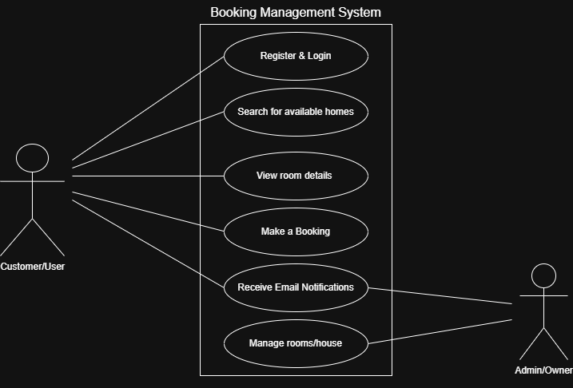

# Requirement Analysis in Software Development.
This project aims to sharpen skills essential for managing and delivering robust software systems by focusing on the cornerstone of successful development.
## 📌 Introduction

This repository provides a comprehensive breakdown of the **Requirement Analysis** phase within the software development lifecycle (SDLC). It Focuses on a real-world case study: a full-stack property booking application.
- The goal is to helps teams and individuals:
  - Identify and document **functional** and **non-functional** requirements.
  - Understand and apply key activities like gathering, elicitation, documentation, and validation.
  - Improve clarity, reduce ambiguity, and ensure alignment among stakeholders.
- 🧰 Supports developers, project managers, and analysts in building better, user-focused software.

## 📘 What is Requirement Analysis?

**Requirement Analysis** is a foundational phase in the Software Development Life Cycle (SDLC) where the needs, expectations, and constraints of stakeholders are gathered, analyzed, and clearly documented. This process ensures that everyone involved—developers, designers, project managers, and clients—shares a common understanding of what the system is intended to do.

Requirement Analysis plays a foundational role in the success of any software project. Here's why

- ✅ **Clarity & Alignment**  
  It eliminates ambiguity by capturing precise expectations from all stakeholders.

- 🧭 **Defines Project Scope**  
  Helps in setting boundaries and preventing scope creep, keeping the project focused and manageable.

- 💡 **Guides Design and Development**  
  Acts as a blueprint for developers and designers to follow during implementation.

- 📊 **Enables Accurate Estimations**  
  Supports better time, cost, and resource planning.

- 🛠️ **Improves Product Quality**  
  Ensures that the end product meets actual business needs, increasing stakeholder satisfaction and reducing the risk of failure.

### 🚧 In Summary:

Requirement Analysis is not just about listing features — it’s about **understanding the problem**, defining **clear goals**, and laying the groundwork for **effective solutions**. Without it, software projects risk being misaligned with user needs or business goals.

## ❗ Why is Requirement Analysis Important?

Requirement Analysis is one of the most critical steps in the Software Development Life Cycle (SDLC). It lays the foundation for building systems that meet user expectations, avoid costly rework, and deliver long-term value.

Here are three key reasons why Requirement Analysis is essential:

---

### 1. 🎯 **Establishes Clarity and Reduces Ambiguity**

- Helps all stakeholders—clients, developers, testers—develop a shared understanding of the system's goals.
- Prevents misunderstandings by ensuring requirements are well-defined and agreed upon early.

---

### 2. 📦 **Defines Scope and Prevents Scope Creep**

- Clearly outlines the features and boundaries of the project.
- Helps avoid unnecessary additions or changes that could delay timelines and increase costs.

---

### 3. 🏗️ **Provides a Foundation for Design and Development**

- Acts as a blueprint for architects, designers, and developers.
- Ensures technical solutions are aligned with business goals and user needs.

---

## 🛠️ Key Activities in Requirement Analysis

Requirement Analysis involves several structured activities that ensure the software system meets business needs and stakeholder expectations. Below are the five key activities involved:

---

### 📥 Requirement Gathering
- Conduct interviews with stakeholders to understand their needs.
- Distribute surveys or questionnaires for broader input.
- Organize workshops or focus groups for collaborative requirement discussions.
- Observe users in their environment to understand workflows.
- Review existing systems and documentation for context.

---

### ✍️ Requirement Elicitation
- Facilitate brainstorming sessions to uncover new ideas and hidden needs.
- Use focus groups to explore specific user expectations.
- Create low-fidelity prototypes to visualize proposed features and validate early ideas.

---

### 📚 Requirement Documentation
- Create a **Software Requirement Specification (SRS)** document.
- Write **user stories** to describe features from the end-user's perspective.
- Develop **use case diagrams** to illustrate how users will interact with the system.

---

### 📊 Requirement Analysis and Modeling
- Prioritize requirements based on business value, risk, and complexity.
- Conduct **feasibility studies** (technical, financial, and time-based).
- Build models such as **data flow diagrams (DFDs)** and **entity-relationship diagrams (ERDs)** to visualize how components interact.

---

### ✅ Requirement Validation
- Review documented requirements with stakeholders for approval.
- Define **acceptance criteria** to ensure requirements are testable.
- Create **traceability matrices** to track requirements through design, development, and testing.

## 🧩 Types of Requirements

In software engineering, requirements are generally categorized into two major types: **Functional** and **Non-functional**. Both are crucial to building a successful system.

---

### ⚙️ Functional Requirements

**Definition:**  
Functional requirements describe **what the system should do** — the specific behaviors, features, and functions the application must support.

**Examples from Booking Management Project:**

- 🔍 **Property Search:**  
  Users can search for properties using filters such as location, price range, and availability.

- 👤 **User Registration & Login:**  
  Users can create an account, log in securely, and manage their profile.

- 🏠 **Property Listings:**  
  The system should display available properties with details like images, price, location, and amenities.

- 📅 **Booking System:**  
  Users can select available dates, confirm bookings, and view their booking history.

- 📨 **Email Notification:**  
  A confirmation email is sent to the user immediately after a booking is completed.

---

### 🛡️ Non-functional Requirements

**Definition:**  
Non-functional requirements define **how the system performs** rather than specific behaviors. They focus on the system's quality attributes like speed, scalability, and security.

**Examples from Booking Management Project:**

- 🚀 **Performance:**  
  Pages should load in under 2 seconds, even under heavy load (e.g: 1000 concurrent users).

- 🔐 **Security:**  
  Passwords must be encrypted. The system should prevent common vulnerabilities (e.g., SQL injection, XSS).

- 📈 **Scalability:**  
  The system must be able to scale horizontally to support increased traffic during peak periods.

- 📱 **Usability:**  
  The interface should be intuitive, with mobile responsiveness as a priority.

- ☁️ **Reliability:**  
  The system must maintain 99.9% uptime and support automatic recovery from failures.

---

> *While functional requirements define "what" the system does, non-functional requirements define "how well" the system performs those tasks.*

## 🧾 Use Case Diagrams

Use Case Diagrams are a core part of **Requirement Analysis** used to visually represent how users (actors) interact with a system. They help development teams understand the functional scope and user goals early in the project lifecycle.

### 🔍 What is a Use Case Diagram?

A **Use Case Diagram** is a UML (Unified Modeling Language) tool that outlines:
- The different types of users (actors) interacting with the system.
- The major system functionalities (use cases) from the user's perspective.
- The relationships between users and the actions they perform.

### ✅ Benefits of Use Case Diagrams
- Provide a **clear visual representation** of system interactions.
- Enhance **communication between stakeholders** and developers.
- Help **identify and organize** the system’s functional requirements.
- Support **prioritization** and better planning of development efforts.

---

### 🎯 Use Case Diagram for Booking System

**Actors:**
- **Guest**: A user browsing without logging in
- **Registered User**: A logged-in user who can book, cancel, and receive confirmations
- **Admin**: A user who manages listings and overall platform content

**Use Cases:**
- **Search Properties**
- **View Property Details**
- **Register/Login**
- **Book Property**
- **Cancel Booking**
- **Receive Confirmation Email**
- **Manage Listings**

### 🖼️ Diagram

